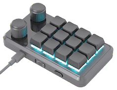

Mini Keyboard - One-Handed Macro Mechanical Keyboard
---

 

The program 'MINI_KEYBOARD.exe' always starts maximised and doesn't save its state.

This script just starts MiniKeyboard and resizes as needed.

This Type:

| Keyboard | Software |
|:--------:|:--------:|
|   |   |

[Sikaicase Shop](https://sikaicase.com/products/one-handed-macro-mechanical-keyboard-12-keys-gaming-keyboard-fully-programmable-for-knobs-and-keys-osu-keypad-hotswap-keypad-with-rgb-for-game-editing-ps-12-keys-2-4g-3-layer-black-1?_pos=4&_sid=65ce219e3&_ss=r)

[Download MiniKeyBoard Software](https://sikaicase.com/blogs/support/setting-for-software) *(Other Sellers Available.)*

 
*Script comes in two versions. AHK v2 and Python.*

